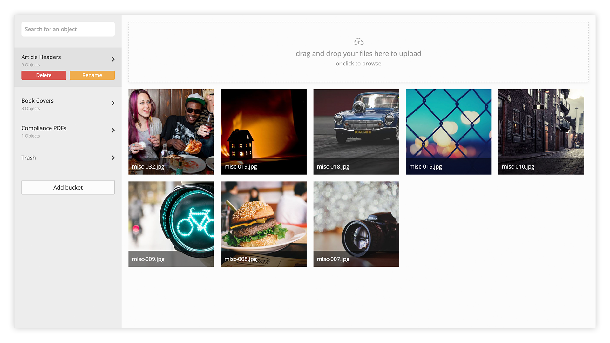

# Admin

This CDN module adds two control panels to the [Admin](../admin/) sidebar: [Media Manager](admin.md#media-manager) and [Import via URL](admin.md#import-via-url).

## Media Manager

The Media Manager is the primary user interface for organising [buckets](./#buckets) and [objects](./#objects) in the CDN. The Media Manager provides a mechanic for creating new buckets, uploading new objects, as well as an interface for searching for objects across all buckets.



### CDN Object Pickers

To select items from the media manager, your admin interfaces will need to use CDN Object Pickers. These are form inputs which open the manager and allow the user to select an item from the CDN to associate with an entity, for example, you might like to allow users to upload logos, header images, avatars etc.

CDN Object Pickers can be created by [setting a model field's](../../key-concepts/factory/models/#describing-fields) `type` to:

```
Nails\Cdn\Helper\Form::FIELD_OBJECT_PICKER
```

&#x20;For manually created views, the following helper function can be used:

```php
echo form_field_cdn_object_picker([
  'key'   => 'cover_id',  
  'label' => 'Cover Image'
]);
```

A CDN object picker looks like this and opens the Media Manager in a modal when the `Browse` button is clicked:


## Import via URL

There are times when uploading into the media manager is not possible, usually because the file size being uploaded exceeds the configured limits of the server or an interim party limits request size. Whilst in some instances it can be an easy fix to keep increasing upload limits, large limits open up potential attack vectors so for one off uploads it can be safer to import via a URL.

Uploads done via the [Media Manager](admin.md#media-manager) are _push_ uploads, i.e the file is sent to the server from the browser; Import via URL is a _fetch_ operation - the file exists on a public URL somewhere and is downloaded by the server for insertion into the CDN.

Once you have your item uploaded somewhere appropriate then it is simply a case of pasting the item's URL into the `Public URL` field, selecting which bucket you'd like it to be put in and hitting the blue `Import` button. The system will validate it can access the URL, and schedule an import to be run within the next minute.


Once accepted, you can see what state the import is in:


Once the upload reaches `complete` status it will be available for selection in the Media Manager. Any errors will be reported here, too.

### Getting a public URL

It is important that the URL of the source object is public and direct. This means that when visiting the URL only the file is made available and not propriatary UI of the hosting service, e.g. Dropbox, WeTransfer, or Google Drive.

We recommend using services such as AWS S3, however see below for instructions on how to use some common storage providers

#### Dropbox

Dropbox provides commenting and other collaborative tools when using their share links - however by tweaking the URL slightly you can get a direct URL suitable for use.

1. Upload the file into Dropbox
2. [Get the file's share link](https://help.dropbox.com/files-folders/share/view-only-access) via Dropbox website or integrated Dropbox app
3. Once you have the link, pate it somewhere
4. Change the URL so the domain `www.dropbox.com` becomes `dl.dropboxusercontent.com`, for example:
   1. `https://www.dropbox.com/s/hriinb9w3a2107m/file-name.pdf` would become
   2. `https://dl.dropboxusercontent.com/s/hriinb9w3a2107m/file-name.pdf`
5. Paste the amended URL into the Import via URL's `Public URL` field and import

#### Google Drive

Google Drive doesn't offer any way to get native/direct links easily, however some third party tools and guides are available to help you with this:

* [Google Drive Direct Download Link Generator](https://www.gdirect.link/)
* [How to Get Direct or Permanent Link for Google Drive Files](https://bydik.com/google-drive-direct-link/)
